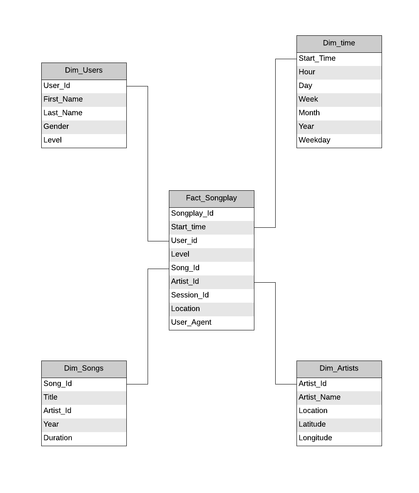

# Data Modeling with Postgres

## Purpose

A simple database created for a music streaming app with tables optimized for queries on song play analysis.

## Raw Data

- All files are in JSON format
- Song dataset: contains metadata about songs and the artist of each song
- Log dataset: contain logs from the music streaming app

## Database Star Schema

## ETL pipeline

- Extract the raw data into Python wrapper with pandas
- Transform to dataframes which are different subsets of the original raw datasets
- Load into SQL tables using simple INSERT's and JOIN's 

## Example

Analyze the streaming activity for each day of the week with Monday = 0, Sunday = 6.

`%sql SELECT weekday, COUNT(*) as num FROM time GROUP BY weekday ORDER BY num DESC;`

| weekday | num  |
|---------|------|
| 2       | 1361 |
| 4       | 1294 |
| 1       | 1070 |
| 3       | 1051 |
| 0       | 1014 |
| 5       | 627  |
| 6       | 396  |